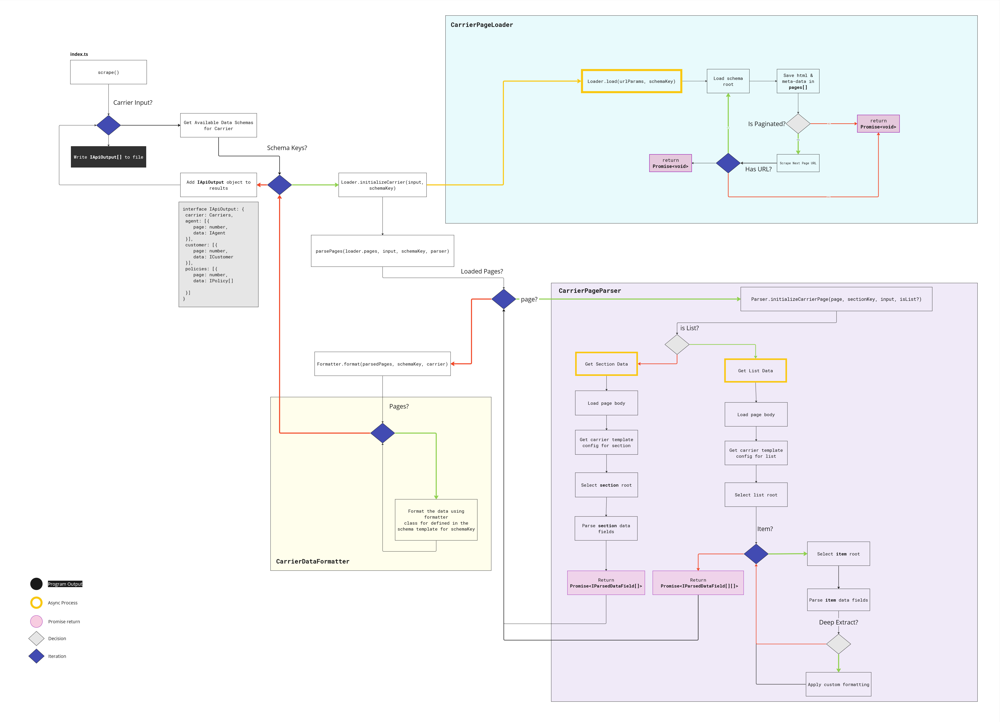

# TypeScript Carrier Scraper


## How to use
[Download Node](https://nodejs.org/en/) if you don't already have it on your machine.

### Scripts
Navigate to the project root directory and run `yarn install` to install the required dependencies.

`yarn start`: compiles `index.ts` and runs it.

# CarrierTemplate
Each Carrier has a Carrier Template which is used to define the behavior of our scraper when loading and parsing its pages.
The `CarrierTemplate` definition is located at the path `./data/carrier-template.ts`.

### ITemplateElement
Most of the fields on the `ICarrierTemplate` are of type `ITemplateElement`.
This interface provides us with a path to selecting and parsing data for each individual field.
```typescript
export interface ITemplateElement {
    // element tag type
    element: string, 
    // selector string, used to find the element on page
    select: string,
    // optional #id
    id?: string, 
    // Custom function to deeply extract 
    // data from unstructured elements
    deepExtract?: Function
}
```

### Root
Each section of the `ICarrierTemplate` (`agent`, `customer`, `policies`) also has a root element.
The root element allows us to limit the scope of our parser. 

The selectors for individual data fields are relative to that section's root element.

### Pagination
`ICarrierTemplate` also allows us to specify if a given carrier has paginated data with the `isPaginated` flag.

For paginated carriers, the `page: ItemplateElement` field should contain a selector
for the element which performs the page navigation. 

In the case of this program, the `page` field is used for `Placeholder Carrier`, and we are specifically grabbing its `href` attribute.

The `CarrierPageLoader` class is capable of recursively crawling and storing multiple pages to be parsed by `CarrierPageParser`.
```typescript
interface ICarrierTemplate {
    baseUrl: string,
    carrierUrl: string,
    isPaginated: boolean,
    page?: ITemplateElement,
    agent: {
        root: ITemplateElement,
        dataFields: {
            name: ITemplateElement,
            producerCode: ITemplateElement,
            agencyName: ITemplateElement,
            agencyCode: ITemplateElement
        }
    },
    customer: {
        root: ITemplateElement,
        dataFields: {
            name: ITemplateElement,
            id: ITemplateElement,
            email: ITemplateElement,
            address: ITemplateElement
        }
    },
    policies: {
        root: ITemplateElement,
        item: ITemplateElement,
        dataFields: {
            id: ITemplateElement,
            premium: ITemplateElement,
            status: ITemplateElement,
            effectiveDate: ITemplateElement,
            terminationDate: ITemplateElement,
            lastPaymentDate: ITemplateElement,
            commissionRate?: ITemplateElement,
            numberInsured?: ITemplateElement
        }
    }
}
```


# Classes

## CarrierPageLoader
The `CarrierPageLoader` class is used to load and store page bodies for a given Carrier.


It is capable of recursively crawling across paginated data. 

## CarrierPageParser

The `CarrierPageParser` class is capable of parsing data fields specified in the `CarrierTemplate` configuration.


The purpose of the `CarrierPageParser` class is to extract values from an HTML page in a normalized format.

Each individual data point parsed by this class is formatted as an `IParsedField` object.


### IParsedField
Individual data field parsed from html body.

```typescript
interface IParsedField {
    fieldName: string,
    value: string | null
}
```

### IParsedPage
Collection of data fields parsed from html body and organized by data category.

`IParsedPage` is returned by `CarrierPageParser.getData()`. 
```typescript
interface IParsedPage {
    agent: IParsedField[],
    customer: IParsedField[],
    policies: IParsedField[][]
}
```

## CarrierDataFormatter

The `CarrierDataFormatter` class takes an array of `IParsedPage` objects as an input
and transforms the data into a more readable/usable format.

Ultimately, this class orchestrates the overall formatting of page data using the following formatter classes:
`Agent`, `Customer`, `Policy`.

The `format()` method outputs the data as `IApiOutput[]`

### IApiOutput

```typescript
interface IApiOutput {
    carrier: Carriers,
    agent: IAgent,
    customer: ICustomer,
    policies: IPolicy[],
    page: number
}
```

# Output

The project specifications state to output the data as a JSON array with 2 items, 1 for each page.


You'll find that the array output by the program will contain 4 items. 
This takes into consideration the 3 pages of data on the `Placeholder Carrier` page.

After running the `yarn start` command, the final JSON array will be printed to the console and saved in `./out/<today's date>.json`.

I've included a sample output file: `Fri Apr 12 2024.json`.